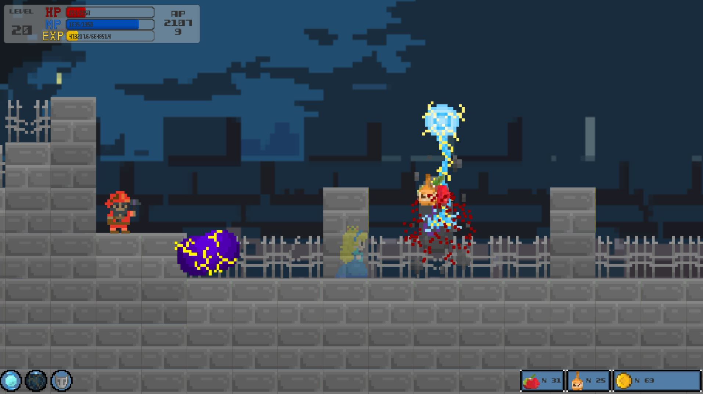
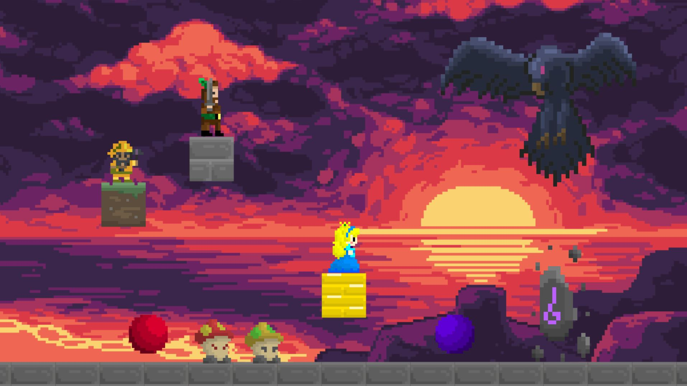

# Snow White - Bloody Princess

## 설명

유니티 5로 제작한 2D 플랫포머 게임으로, 같은 장르의 유명한 게임인 '메이플 스토리'의 모방이 목표이다.
주인공 캐릭터는 게임 제목과 같이 백설공주를 모티브로 하였으며, 게임 진행 중에 여러 명의 난장이들이 등장한다.
총 세 가지 기술을 사용하여, 마녀의 변신 모습인 거대 까마귀를 물리치는 것이 이 게임의 목표이다.

## 담당 파트

* 캐릭터 구현
	* 이동
	* 스킬 사용
	* 체력, 레벨 시스템
* 몬스터 형태 및 애니메이션 디자인

## 실행 파일

	Release/SnowWhite.exe
    
## 조작 방법

Action | Key
-------|-----
좌/우 이동 | ← / →
점프 | Alt
아이템 줍기 | Z
HP 아이템 사용 | X
MP 아이템 사용 | C
NPC와 대화 or 상점 이용 | Q
마력 구체 스킬 | Ctrl
번개 스킬 | Shift
방패 스킬(방어력 상승) | A
확인 | Enter
일시 정지 | Esc
레벨업(치트키) | F9
